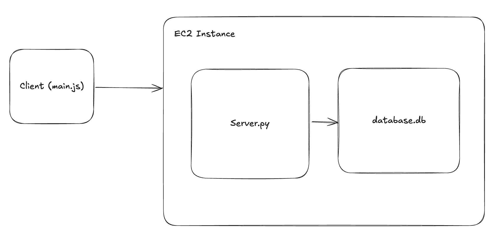

# Vulineage
Vulnerability Lineage Visualizer

This repo maintains the website hosted at tool.vulineage.com

## Origin
This tool was developed for UMD's Spring 2025 CMSC734 Information Visualization Course.

## Connecting to the data server
The following command assumes you have the `vulineage-database-ssh-key.pem` on your Desktop.

`ssh -i ~/Desktop/vulineage-database-ssh-key.pem ec2-user@ec2-204-236-197-103.compute-1.amazonaws.com`

## Copying the server.py to the database server
`scp -i ~/Desktop/vulineage-database-ssh-key.pem ~/repos/ajmedeio/vulineage/database_server.py ec2-user@ec2-204-236-197-103.compute-1.amazonaws.com:/home/ec2-user`

## Testing

Use the following curl command like `curl ... > input.json`
Then using the following to get the output.csv file
`python3 json_to_csv.py`

`curl -H "Accept: application/json" -H "Content-type: application/json" -X POST -d '{"query":"select 1"}' https://database.vulineage.com`

### get_lineage_by_lineage_id.json
`curl -H "Accept: application/json" -H "Content-type: application/json" -X POST -d @get_lineage_by_lineage_id.json https://database.vulineage.com`

### get_vulnerabilities_by_image_id.json
`curl -H "Accept: application/json" -H "Content-type: application/json" -X POST -d @get_vulnerabilities_by_image_id.json https://database.vulineage.com`

### get_lowMedium_vulnerabilities_by_image_id.json
curl -H 'Accept: application/json' -H 'Content-type: application/json' -X POST -d @get_lowMedium_vulnerabilities_by_image_id.json https://database.vulineage.com

For windows user, just change the double quotes into single quotes in `curl` commands

## Checking Server Logs (while ssh'ed into database server)
`journalctl -u database_server.py.service -f`

## Architecture

# Getting Started For Local Development
To get started, we can run the frontend_server.py using `python frontend_server.py` or `python3 frontend_server.py` from your project root.

Then open your browser to localhost:9731 to open the index.html found under the artifact directory.

When you commit to main branch, the artifact will automatically get pushed to AWS S3 where it can be reached by the internet.
