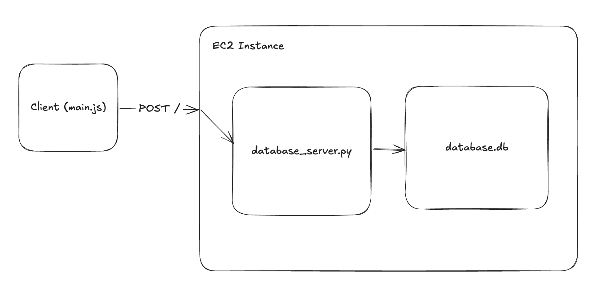

# Vulineage
Vulnerability Lineage Visualizer

This repo maintains the website hosted at https://tool.vulineage.com

## Origin
This tool was developed for UMD's Spring 2025 CMSC734 Information Visualization Course.

## Getting Started For Local Development
To get started, we can run the frontend_server.py using `python frontend_server.py` or `python3 frontend_server.py` from your project root.

Then open your browser to localhost:9731 to open the index.html found under the artifact directory.

When you push to the main branch, the artifact will automatically get pushed to AWS S3 where its accessible on https://tool.vulineage.com

## Interacting with the data server
The following command assumes you have the `vulineage-database-ssh-key.pem` on your Desktop. These are provisioned from the AWS account and cannot be checked-in. Please ask Alex to provision a key if you need it!

`ssh -i ~/Desktop/vulineage-database-ssh-key.pem ec2-user@ec2-34-224-22-121.compute-1.amazonaws.com`

### Copying the server.py to the database server
`scp -i ~/Desktop/vulineage-database-ssh-key.pem ~/repos/ajmedeio/vulineage/server/database_server.py ec2-user@ec2-34-224-22-121.compute-1.amazonaws.com:/home/ec2-user`

### Testing

Use the following curl command like `curl ... > input.json`
Then using the following to get the output.csv file
`python3 scripts/json_to_csv.py`

`curl -H "Accept: application/json" -H "Content-type: application/json" -X POST -d '{"query":"select 1"}' https://database.vulineage.com`

### get_root_lineages.json
`curl -H "Accept: application/json" -H "Content-type: application/json" -X POST -d @get_root_lineages.json https://database.vulineage.com`

For windows user, just change the double quotes into single quotes in `curl` commands

### Checking Server Logs (should first ssh into database server)
`journalctl -u database_server.py.service -f`

## Architecture

## Visualization Information
It includes a zoomable icicle plot, a dynamic vulnerability timeline with detailed per-category vulnerability count, and hover-based image metadata — the system enables users to track the propagation of vulnerabilities, determine lineage health, and select the most secure image versions.

### Frontend Information
* artifact/index.html – entry point

* lineage-tree_v2.js – icicle plot with hover/click support

* network.js – D3-based force-directed graph

* image_vulnerabilities.js – time-series vulnerability chart and per image total count for different categories of vulnerabilities upon hover

